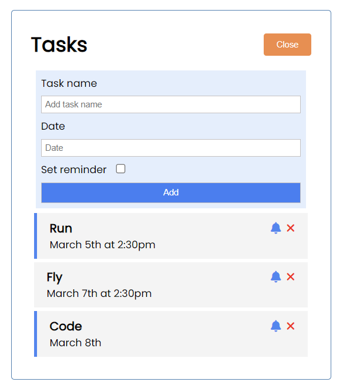

# Simple Task Manager
Small project to learn Vue.js



## Features
- Add a new task
- Set date
- Highlight existing tasks
- Delete a task

## Technologies Used
- Vue.js

## Project Setup

Clone the repository and run:

```sh
npm install
npm run dev
```
